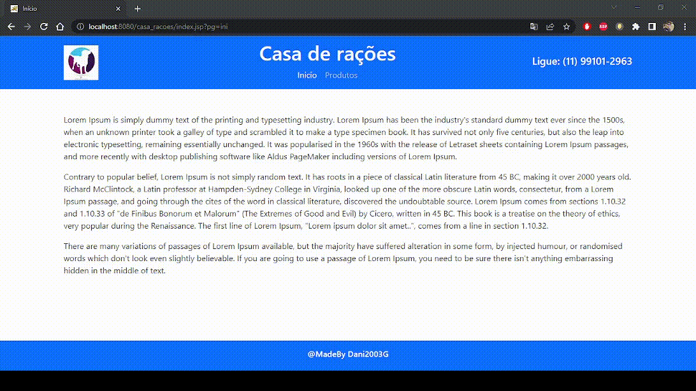

<h1 aling=center>
    
    <br>
    Site
</h1>

## 📋 Sobre
O projeto casa rações foi criado para ser enviado para um empresa, que pediu um crud de java/web.

---

## 🚀 Tecnologias utilizadas

- Bootstrap 5
- JSP
- HTML 5
- CSS3
- MySQL
- JDBC
- Java

---

📁 Como baixar o projeto

```bash
# Clonar o repositório

$ git clone https://github.com/Dani2003G/casa_racoes

# Entrar no diretório
$ cd casa_racoes

# Instalar as dependências
$ yarn install

# Iniciar o projeto
$ yarn start

```